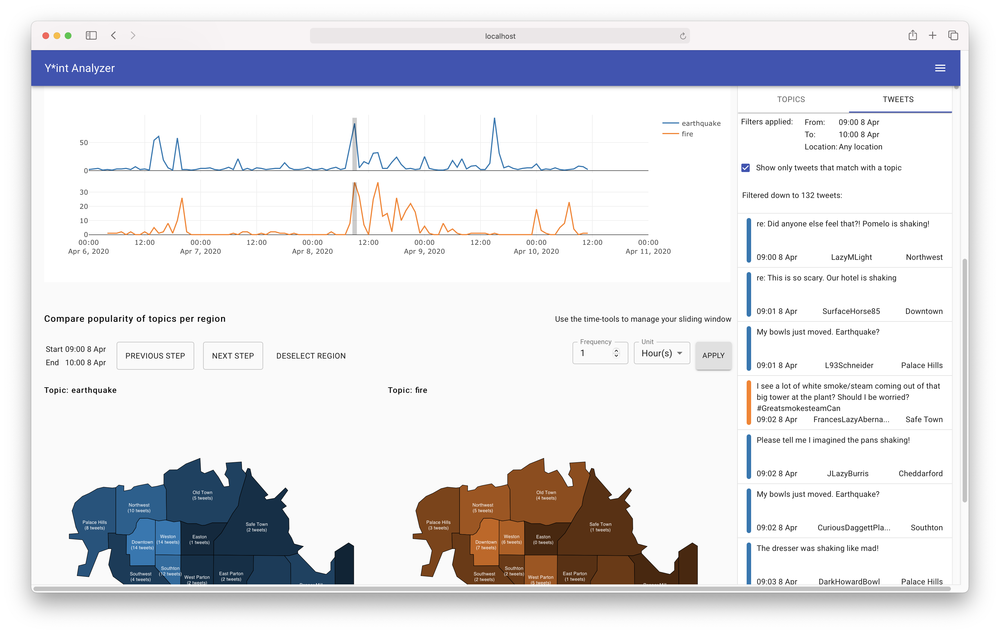

# 2AMV10 - Final Project
*A Visual Analytics tool for reconstructing a timeline of events from tweet-like data*

## Quick start

The tool is split into a front- and backend and communication happens over HTTP. The application is stateless, which means that all user-configuration is stored in the browser.

**Backend: Python/Flask REST API**

1. `cd backend`
2. _Optional_: create a venv
3. Install pip dependencies `pip install -r requirements.txt`
4. Install Spacy english language model `python -m spacy download en_core_web_lg`
5. Start the server: `FLASK_APP=main.py flask run`
6. _Optional_ Start the server in development mode: `FLASK_APP=main.py FLASK_ENV=development flask run`

**Frontend: ReactJS Web Application**

1. `cd frontend`
2. Install dependencies: `yarn install`
3. Run in development mode: `yarn run start`
